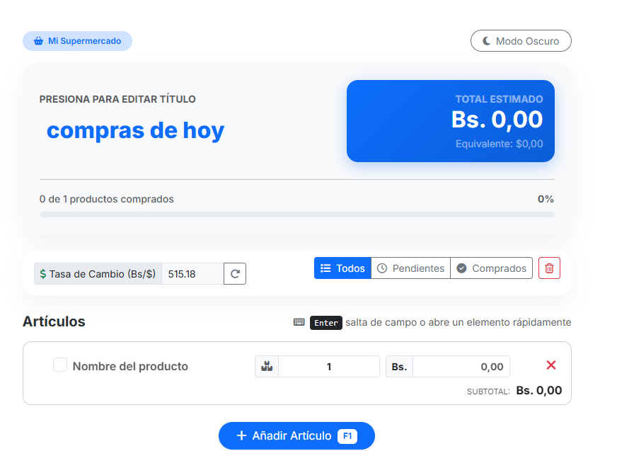

# Súper Lista de Compras 🛒

Una aplicación web moderna, responsiva y fácil de usar diseñada para gestionar tus compras de supermercado. Permite calcular el total estimado de los productos pendientes, llevar un control de lo que ya has adquirido y convertir automáticamente los montos de Bolívares (Bs) a Dólares (USD) utilizando la tasa oficial del Banco Central de Venezuela (BCV).

## Características Principales ✨

- **Gestión Ágil de Artículos:** Añade productos, modifica cantidades y precios en tiempo real. 
- **Cálculo de Totales Inteligente:** El "Total Estimado" suma los subtotales, pero resta automáticamente el valor de los artículos una vez que los marcas como "comprados".
- **Integración con el BCV (DolarAPI):** Obtiene automáticamente la tasa de cambio oficial del dólar en Venezuela al iniciar la aplicación, mostrando un equivalente aproximado de tu compra en dólares. 
- **Persistencia de Datos:** Todo se guarda automáticamente en tu navegador usando `LocalStorage`. Si cierras o recargas la página accidentalmente, no perderás tu lista.
- **Modo Claro / Oscuro 🌙:** Alterna entre una interfaz clara o una oscura según tu preferencia; tu elección también se guardará.
- **Diseño Responsivo (Mobile First):** Interfaz altamente optimizada para ser utilizada desde tu celular mientras caminas por el pasillo del supermercado.
- **Filtros Rápidos:** Puedes ver "Todos" tus artículos, solo los "Pendientes" o repasar los que ya están "Comprados".

## Tecnologías Utilizadas 💻

- **HTML5:** Estructura semántica.
- **CSS3 (Vanilla & Bootstrap 5):** Diseño visual, sistema de cuadrículas para la adaptación a móviles y variables nativas para los temas (claro/oscuro).
- **JavaScript (ES6):** Lógica de control de estado, manipulación del DOM, almacenamiento local y peticiones asíncronas (`fetch`) a la API de divisas.
- **Font Awesome:** Íconos vectoriales de la interfaz.

## Estructura del Proyecto 📂

El código sigue una arquitectura sencilla y limpia dividida en tres archivos principales:

- `index.html`: La maquetación y la presentación de la aplicación.
- `styles.css`: Todos los estilos personalizados y ajustes de compatibilidad visual, separados del HTML.
- `app.js`: La lógica interna, el manejo del `state` (estado de la lista) y las peticiones a la API del dólar.

## Cómo Utilizarlo 🚀

1. No es necesario instalar dependencias de servidor. Simplemente abre `index.html` en cualquier navegador moderno.
2. (Recomendado) Puedes servir la aplicación usando alguna extensión como `Live Server` en VS Code para tener recarga automática durante el desarrollo.

### Atajos Útiles
- Presiona **F1** para agregar un nuevo elemento a la lista rápidamente.
- Usa **Enter** dentro de los campos para saltar dinámicamente entre nombre, cantidad, y precio, o para generar un nuevo artículo cuando llegas al final.

## API Externa 🔌

Para obtener la tasa de cambio oficial del BCV, este proyecto consume el endpoint público de [DolarAPI Venezuela](https://ve.dolarapi.com/v1/dolares). La actualización se hace en segundo plano mediante programación asíncrona.

---
*Diseñado para hacer tus idas al supermercado más ordenadas y predecibles económicamente.*
